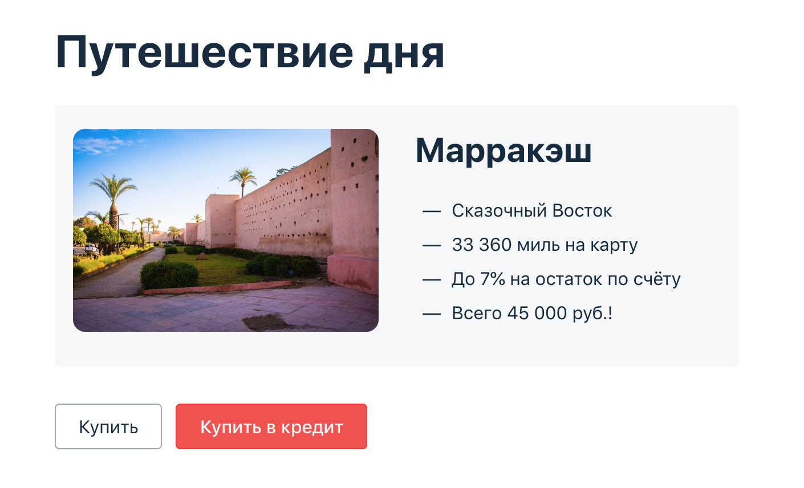

# План автоматизации тестирования
## Объект тестирования:
### Веб-сервис, который предлагает купить тур по определённой цене двумя способами:
1. Обычная оплата по дебетовой карте.
2. Выдача кредита по данным банковской карты.
   
## Данные валидных карт
### Разрешенная карта
<table>
   <tbody>
      <tr>
         <th colspan="6">APPROVED</th>
      </tr>
      <tr>
         <th colspan="2" rowspan="2">Номер карты</th>
         <th colspan="2">Срок действия</th>
         <th rowspan="2">Владелец</th>
         <th rowspan="2">CVV</th>
      </tr>
      <tr>
         <td>Месяц</td>
         <td>Год</td>
      </tr>
      <tr>
         <th>4444 4444 4444 4441</th>
         <th colspan="2">Больше или равен текущему, но не блоее 5 лет</th>
         <th>Больше или равен текущему</th>
         <th>Имя фамилия латиницей</th>
         <th>Число от 000 до 999</th>
      <tr>
    </tbody>
</table> 

### Запрещенная карта
<table>
    <tbody>
      <tr>
         <th colspan="6">DECLINED</th>
      </tr>
      <tr>
         <th colspan="2" rowspan="2">Номер карты</th>
         <th colspan="2">Срок действия</th>
         <th rowspan="2">Владелец</th>
         <th rowspan="2">CVV</th>
      </tr>
      <tr>
         <td>Месяц</td>
         <td>Год</td>
      </tr>
      <tr>
         <th>4444 4444 4444 4442</th>
         <th colspan="2">Больше или равен текущему, но не блоее 5 лет</th>
         <th>Больше или равен текущему</th>
         <th>Имя фамилия латиницей</th>
         <th>Число от 000 до 999</th>
      <tr>
   </tbody>
</table>

## Данные не валидной карты:

### Карта отсутствующая в системе
<table>
    <tbody>
      <tr>
         <th colspan="6"></th>
      </tr>
      <tr>
         <th colspan="2" rowspan="2">Номер карты</th>
         <th colspan="2">Срок действия</th>
         <th rowspan="2">Владелец</th>
         <th rowspan="2">CVV</th>
      </tr>
      <tr>
         <td>Месяц</td>
         <td>Год</td>
      </tr>
      <tr>
         <th>Случайное число длинной 16 знаков</th>
         <th colspan="2">Больше или равен текущему, но не блоее 5 лет</th>
         <th>Больше или равен текущему</th>
         <th>Имя фамилия латиницей</th>
         <th>Число от 000 до 999</th>
      <tr>
   </tbody>
</table>

## Перечень автоматизируемых сценариев
### 1. Покупка [разрешенной картой](#разрешенная-карта), отображается сообщение об одобрении банком.
* Открыть [страницу покупки тура](http://localhost:8080)
* Нажать `Купить`
* Заполнить данные [разрешённой карты](#разрешенная-карта) (APPROVED)
* Нажать `продолжить`
* Ожидать уведомления об одобрении банком
### 2. Покупка [запрещенной картой](#запрещенная-карта). Отображается сообщение об отказе банком
* Открыть [страницу покупки тура](http://localhost:8080)
* Нажать `Купить`
* Заполнить данные [запрещенной](#разрешенная-карта) карты (DECLINED)
* Нажать `продолжить`
* Ожидать уведомления отказа банком
### 3. Покупка картой отсутствующей в системе. Отображается сообщение об отказе банком
* Открыть [страницу покупки тура](http://localhost:8080)
* Нажать `Купить`
* Ввести номер карты отсутствующий в системе. Например `4585697231935162`
* Ввести имя латиницей. Например `Ivanov Ivan`.
* Ввести срок действия карты (Позже текущей даты)
* Ввести CVV трехзначное число в границах `000...999`
* Ожидать уведомления отказа банком
### 4. Оплата в кредит [разрешенной](#разрешенная-карта), отображается сообщение об подтверждении банком
* Открыть [страницу покупки тура](http://localhost:8080)
* Нажать `Купить в кредит`
* Заполнить данные [разрешённой карты](#разрешенная-карта) (APPROVED)
* Нажать `продолжить`
* Ожидать уведомления об одобрении банком
### 5. Оплата в кредит [запрещенной картой](#запрещенная-карта), отображается сообщение об отказе банком 
* Открыть [страницу покупки тура](http://localhost:8080)
* Нажать `Купить в кредит`
* Заполнить данные [запрещенной](#разрешенная-карта) карты (DECLINED)
* Нажать `продолжить`
* Ожидать уведомления отказа банком
### 6. Оплата в кредит картой отсутствующей в системе. Отображается сообщение об отказе банком
* Открыть [страницу покупки тура](http://localhost:8080)
* Нажать `Купить в кредит`
* Ввести номер карты отсутствующий в системе. Например `4585697231935162`
* Ввести имя латиницей. Например `Ivanov Ivan`.
* Ввести срок действия карты (Позже текущей даты)
* Ввести CVV трехзначное число в границах `000...999`
* Ожидать уведомления отказа банком
### 7. Оплата картой, дата действия в верхней границе (текущая дата + 5 лет), отображается сообщение об одобрении банком"
* Открыть [страницу покупки тура](http://localhost:8080)
* Нажать `Купить`
* Заполнить данные [разрешённой карты](#разрешенная-карта) (APPROVED)
* В полях даты вписать дату + 5 лет от текущей
* Нажать `продолжить`
* Ожидать уведомления об одобрении банком
### 8. Оплата картой, дата действия которой выше верхней границе (5 лет + 1 месяц), заявка не отправляется, ошибка валидации поля 'Неверно указан срок действия карты'
* Открыть [страницу покупки тура](http://localhost:8080)
* Нажать `Купить`
* Заполнить данные [разрешённой карты](#разрешенная-карта) (APPROVED)
* В полях даты вписать дату + 61 месяц  от текущей
* Нажать `продолжить`
* Ожидать ошибки валидации поля года с сообщением 'Неверно указан срок действия карты'
### 9. Оплата картой, дата действия которой выше верхней границе (5 лет + 2 месяца), заявка не отправляется, ошибка валидации поля 'Неверно указан срок действия карты
* Открыть [страницу покупки тура](http://localhost:8080)
* Нажать `Купить`
* Заполнить данные [разрешённой карты](#разрешенная-карта) (APPROVED)
* В полях даты вписать дату + 62 месяц от текущей
* Нажать `продолжить`
* Ожидать ошибки валидации поля года с сообщением 'Неверно указан срок действия карты'
### 10. Оплата картой, дата действия которой меньше текущей, заявка не отправляется, ошибка валидации поля 'Неверно указан срок действия карты.
* Открыть [страницу покупки тура](http://localhost:8080)
* Нажать `Купить`
* Заполнить данные [разрешённой карты](#разрешенная-карта) (APPROVED)
* В полях даты вписать дату - 1 месяц  от текущей
* Нажать `продолжить`
* Ожидать ошибки валидации поля месяц с сообщением 'Неверно указан срок действия карты'
### 11  Оплата картой с нулевым месяцем, ошибка валидации поля месяца. 'Неверно указан срок действия карты'
* Открыть [страницу покупки тура](http://localhost:8080)
* Нажать `Купить`
* Заполнить данные [разрешённой карты](#разрешенная-карта) (APPROVED)
* Заполнить поле года годом + 1 от текущего
* Заполнить полле месяца значением "00"
* Нажать `продолжить`
* Ошибка валидации полля месяц отображается сообщение 'Неверно указан срок действия карты'

### 12. Оплата в кредит с пустым полем номера карты, ошибка валидации поля, Поле обязательно для заполнения
* Открыть [страницу покупки тура](http://localhost:8080)
* Нажать `Купить`
* Заполнить все поля, кроме номера карты, [валидными данными](#данные-валидных-карт-карт) и нажать `продолжить`
* Ожидание сообщения об обязательности заполнения поля
### 13. Оплата картой с пустым полем месяца, ошибка валидации поля, Поле обязательно для заполнения.
* Открыть [страницу покупки тура](http://localhost:8080)
* Нажать `Купить`
* Заполнить все поля, кроме "Месяц", [валидными данными](#данные-валидных-карт-карт) и нажать `продолжить`
* Ожидание сообщения об обязательности заполнения поля номера карты.

### 14. Оплата картой с пустым полем года, ошибка валидации поля, Поле обязательно для заполнения
* Открыть [страницу покупки тура](http://localhost:8080)
* Нажать `Купить`
* Заполнить все поля, кроме поля года, [валидными данными](#данные-валидных-карт-карт) и нажать `продолжить`
* Ожидание сообщения об обязательности заполнения поля под полем года.
### 15. Оплата картой с пустым полем имени, ошибка валидации поля, Поле обязательно для заполнения
* Открыть [страницу покупки тура](http://localhost:8080)
* Нажать `Купить`
* Заполнить все поля, кроме поля "Владелец", [валидными данными](#данные-валидных-карт-карт) и нажать `продолжить`
* Ожидание сообщения об обязательности заполнения поля имя

### 16. Оплата картой с пустым полем CVC, ошибка валидации поля, Поле обязательно для заполнения
* Открыть [страницу покупки тура](http://localhost:8080)
* Нажать `Купить`
* Заполнить все поля, кроме поля "CVC", [валидными данными](#данные-валидных-карт-карт) и нажать `продолжить`
* Ожидание сообщения об обязательности заполнения поля CVC

### 17. Покупка при использовании кириллических символов в имени.
* Открыть [страницу покупки тура](http://localhost:8080)
* Нажать `Купить`
* Заполнить все поля, кроме поля имени, [валидными данными](#данные-валидных-карт-карт) 
* Ввести в поле имени имя и фамилию кириллицей например "Иван Иванов"
* Нажать `продолжить`
* Ожидать сообщения о неправильном формате данных в поле имени.

### 18. Оплата [разрешенной картой](#разрешенная-карта) картой, статус в базе данных 'APPROVED' 
* Открыть [страницу сервса](http://localhost:8080)
* Нажать `Купить`
* Заполнить все поля данными [разрешенной карты](#разрешенная-карта)
* Нажать `Продолжить`
* Проверить правильнось занесения данных в базу. В таблице `payment_entity` статус операции `APPROVED`.

### 19. Оплата [запрещенной картой](#запрещенная-карта), статус в базе данных 'DECLINED'
* Открыть [страницу сервса](http://localhost:8080)
* Нажать `Купить`
* Заполнить все поля данными [запрещенной карты](#запрещенная-карта)
* Нажать `Продолжить`
* Проверить правильнось занесения данных в базу. В таблице `payment_entity` статус операции `DECLINED`.

### 20. Оплата в кредит [разрешенной картой](#разрешенная-карта), статус в базе данных APPROVED
* Открыть [страницу сервса](http://localhost:8080)
* Нажать `Купить в кредит`
* Заполнить все поля данными [разрешенной карты](#разрешенная-карта)
* Нажать `Продолжить`
* Проверить правильнось занесения данных в базу. В таблице `credit_request_entity` статус операции `APPROVED`.

### 21. Оплата в кредит [запрещенной картой](#запрещенная-карта), статус в базе данных DECLINED
 Открыть [страницу сервса](http://localhost:8080)
* Нажать `Купить в кредит`
* Заполнить все поля данными [запрещенной карты](#запрещенная-карта)
* Нажать `Продолжить`
* Проверить правильнось занесения данных в базу. В таблице `credit_request_entity` статус операции `DECLINED`.

### 22.  Оплата [валидной каотой](#данные-валидных-карт-карт), в таблицу order_entity заносится ID транзакции в поле 'payment_id'
* Открыть [страницу сервса](http://localhost:8080)
* Нажать `Купить`
* Заполнить все поля [валидными данными](#данные-валидных-карт-карт).
* Нажать `Продолжить`
* Проверить правильнось занесения данных в базу. В таблицу `order_entity` в поле `payment_id `должно записться значение из поля `transaction_id `таблицы `payment_entity`  

### 23. Оплата в кредит, в в таблицу order_entity  в поле credit_id заносится значение из bank_id таблицы credit_request_entity)
* Открыть [страницу сервса](http://localhost:8080)
* Нажать `Купить в кредит`
* Заполнить все поля [валидными данными](#данные-валидных-карт-карт).
* Нажать `Продолжить`
* Проверить правильнось занесения данных в базу. В таблицу `order_entity` в поле `credit_id` заносится значение из поля `bank_id` таблицы `credit_request_entity`.

### 24. Оплата картой отсутствующей в системе, Данные не заносятся в БД
* Открыть [страницу сервса](http://localhost:8080)
* Нажать `Купить`
* Заполнить все поля данными [карты отсутствующей в системе](#карта-отсутствющая-в-системе).
* Проверить количечтво строк в таблицах `payment_entiti` и `order_entity` командами `SELECT COUNT(*) FROM [имя таблицы соответственно]`
* Нажать `Продолжить`
* Проверить количечтво строк в таблицах `payment_entiti` и `order_entity` командами `SELECT COUNT(*) FROM [имя таблицы соответственно]`. Должно соответствовать колличечтву в первом запросе.

### 25. Кредит по карте отсутствующей в системе, данные не заносятся в БД

* Открыть [страницу сервса](http://localhost:8080)
* Нажать `Купить в кредит`
* Заполнить все поля данными [карты отсутствующей в системе](#карта-отсутствющая-в-системе).
* Проверить количечтво строк в таблицах `credit_request_entiti` и `order_entity` командами `SELECT COUNT(*) FROM [имя таблицы соответственно]`
* Нажать `Продолжить`
* Проверить количечтво строк в таблицах `credit_request_entiti` и `order_entity` командами `SELECT COUNT(*) FROM [имя таблицы соответственно]`. Должно соответствовать колличечтву в первом запросе.

### 26. Проверисть корректность данных  на странице

## Перечень используемых инструментов с обоснованием выбора
* Java 11.x - Язык на котором написано приложение, есть знания по автоматизации на java.
* Gradle популяраная система для автоматизации сборки приложений и сбора статистики об использовании программных библиотек.
* Junit5 Инфраструктура модульного тестирования для Java. Хорошо документирован, повсеместно используется в написянии автотестов.
* Selenide -  фреймворк для автоматизированного тестирования веб-приложений на основе Selenium WebDriver, со стабильными тестаим и мощными селекторами. 
* JavaFaker - Бимблиотека для генерации случайных данных для тестов.
* IntelliJ IDEA — интегрированная среда разработки программного обеспечения. Отлично подходит для java. Можно установить на всех основных операционных системах.
## Перечень и описание возможных рисков при автоматизации
* Отсутствие уникальных локаторов, что может привести в последстыии к ухудшению стабильности тестов.
* Приложение запускается на тестовом сервисе, возможны проблемы при работе сервсиса в реальных условиях.
* Нечеткие требования, отсутствие описания работы с API банковского сервиса. 
* Малое количество тестовых данных, данные карт не соответствуют алгаритму формирования номера карты.
* Малый опыт тестировщика, что можнт увелить сроки выполенния проекта тестирования.
## Интервальная оценка с учётом рисков (в часах)
* Настройка тестового окружения - 8 часов.
* Написание и отладка тестов - 40 часов
* Выполнение теств и заведение отчетов об ошибках - 9 часов
* Написание и подотовка отчета о тестировании -8 часов
* Итог с учетом рискоа 90 часов.
## План сдачи работ
Написание автотестов 20.12.2022
Прогон и подготовка отчета 22.12.2022

